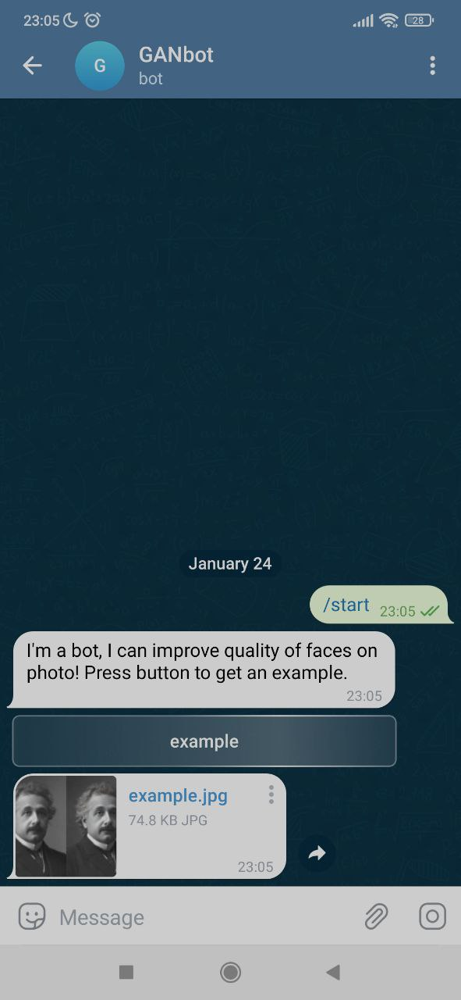

# GANbot

GANbot is a telegram bot that was made as the final project of
the [Deep Learning School](https://dls.samcs.ru/). It can 
improve quality of photos with faces via GAN.

Below you see a brief example of a dialog. To upload your photo
simply attach it to a bot via button with a paper clip.

